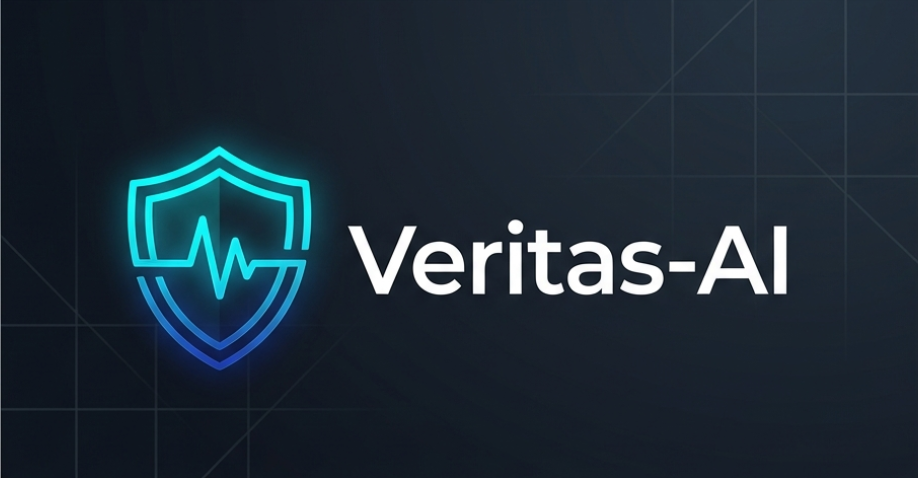
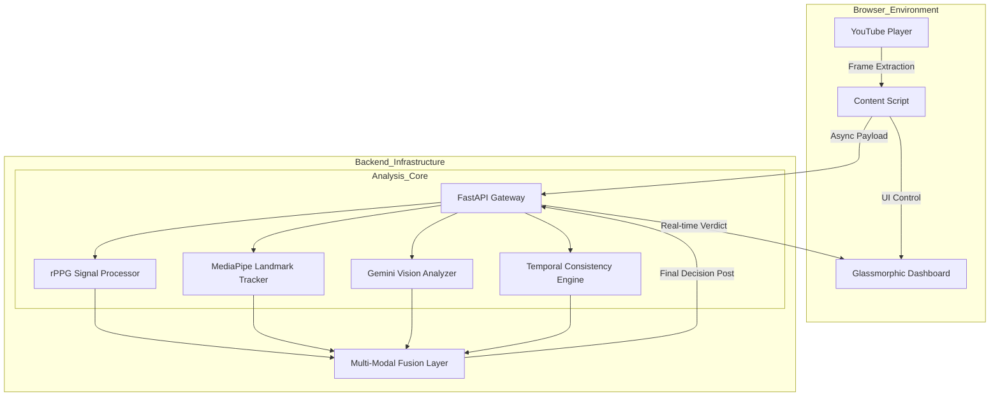

# Veritas-AI 🛡️

[](https://opensource.org/licenses/MIT)
[](https://www.python.org/downloads/)
[](https://nodejs.org/)
[](https://developer.chrome.com/docs/extensions/)

> **The Digital Bio-Guard: Real-time Deepfake Detection using Biometric Signal Analysis (rPPG) and Multimodal AI.**
>
> 🔴 **Live Demo:** [https://veritas-ai-vhbc.onrender.com/](https://veritas-ai-vhbc.onrender.com/)



Veritas-AI is an open-source browser extension designed to restore trust in digital media. It verifies video authenticity by detecting **rPPG (Remote Photoplethysmography)** signals — the subtle, invisible pulse-induced skin color changes that generative AI and deepfakes currently cannot replicate faithfully.

---

## 🏗️ Detailed System Architecture

Veritas-AI operates on a multi-layered forensic architecture that combines biological signal processing with advanced visual analysis.

### 1. Frontend Intelligence (Chrome Extension)
The client-side layer is responsible for non-intrusive monitoring and data acquisition:
- **Injection Engine**: Uses Content Scripts to inject the "VERITAS" control seal into YouTube's shadow DOM.
- **Dynamic Frame Capture**: Leverages the `CanvasCapture` API to extract high-resolution frame sequences at 30 FPS without interrupting video playback.
- **Glassmorphic UI**: Built with React and Tailwind CSS, providing a high-fidelity dashboard for results that feels native to the browser.

### 2. High-Performance API (FastAPI)
The bridge between the browser and the detection engine:
- **Asynchronous Processing**: Handles heavy computation tasks using `BackgroundTasks`, allowing for real-time progress updates.
- **Rate-Limiting & Security**: Implements IP-based rate limiting and secure CORS policies to protect the analysis engine.
- **Structured Logging**: Every analysis generates a forensic trace for transparency and debugging.

### 3. Forensic Analysis Engine (The Core)
The engine runs five specialized "Guards" in parallel:

- **❤️ Bio-Guard (rPPG & Blinks)**: 
    - Extracts the RGB signal from facial regions of interest (ROI).
    - Applies independent component analysis (ICA) to isolate the pulse signal from ambient light noise.
    - Validates "proof of life" through eye-blink frequency analysis.
- **🧠 Physics-Guard (Gemini 2.0 Oracle)**: 
    - Sends keyframes to Google Gemini 2.0 Flash to detect visual anomalies like "phantom teeth," lighting inconsistencies, and boundary blending artifacts.
- **🔄 Temporal-Guard**: 
    - Analyzes frame-to-frame coherence to identify "jittering" or pixel-misalignments common in generative models.
- **👄 Advanced-Guard**: 
    - Performs lip-sync verification and head-movement micro-behavior analysis.
- **⚖️ Ensemble Layer**: 
    - Aggregates findings using a dynamic weighting system, where high-confidence biological signals (pulse) carry higher weight than visual artifacts.



---

## 🌟 Key Features

-   **❤️ Definitive Proof of Life**: Uses rPPG to detect actual human heartbeats—something AI cannot yet replicate.
-   **👁️ Behavioral Analysis**: Detects natural human rhythms, from blinks to micro-expressions.
-   **🧠 Multimodal Verification**: Combines classical computer vision with cutting-edge LLM-based vision models.
-   **🔒 Privacy by Design**: All frame data is processed ephemerally; no personal video data is permanently stored.

---

## 🛠️ Technology Stack

| Layer | Technologies |
| :--- | :--- |
| **Extension** | React 18, TypeScript, Vite, Tailwind CSS |
| **Backend** | Python 3.11+, FastAPI, Uvicorn |
| **Forensics** | OpenCV 4.x, MediaPipe, NumPy, SciPy |
| **Logic** | Google Gemini 2.0 Flash, Pydantic |
| **Deploy** | Docker, Docker Compose |

---

## 📂 Repository Structure

```text
Veritas-AI/
├── backend/                # Analysis engine and API
│   ├── api/                # Endpoints, middleware, and metrics
│   ├── modules/            # The 5 Forensic Guards (rPPG, Gemini, etc.)
│   ├── tests/              # Comprehensive test suite
│   └── main.py             # FastAPI entry point
├── extension/              # React-based Chrome extension
│   ├── content/            # Shadow DOM injection and frame capture
│   ├── popup/              # Glassmorphic control UI
│   └── background/         # Service worker for API comms
├── docs/                   # Documentation and project assets
└── README.md               # Project Home
```

---

## ⚠️ Known Limitations & Roadmap

### Current Version (v1.0)
- Optimized for single-person videos.
- Requires 720p+ resolution for accurate rPPG extraction.

### Future Roadmap
-  **Edge Processing**: Porting the rPPG engine to **WebAssembly (Wasm)** for zero-latency local detection.
-  **Voiceprint Guard**: Integrating audio analysis for voice clone detection.
-  **Multi-Target Analysis**: Parallel detection for multiple people in a single frame.

---

## 🤝 Contributing

We welcome contributions! Please refer to our [CONTRIBUTING.md](CONTRIBUTING.md) to learn how to set up your environment and submit a Pull Request.

---

## 🚀 Getting Started

Ready to install? Follow our [**Getting Started Guide**](docs/GETTING_STARTED.md) to set up the backend and extension in under 5 minutes.

---

## 📄 License

Veritas-AI is released under the **MIT License**. See [LICENSE](LICENSE) for more details.

<p align="center">
  Built with ❤️ for a Truthful Digital Future.
</p>
