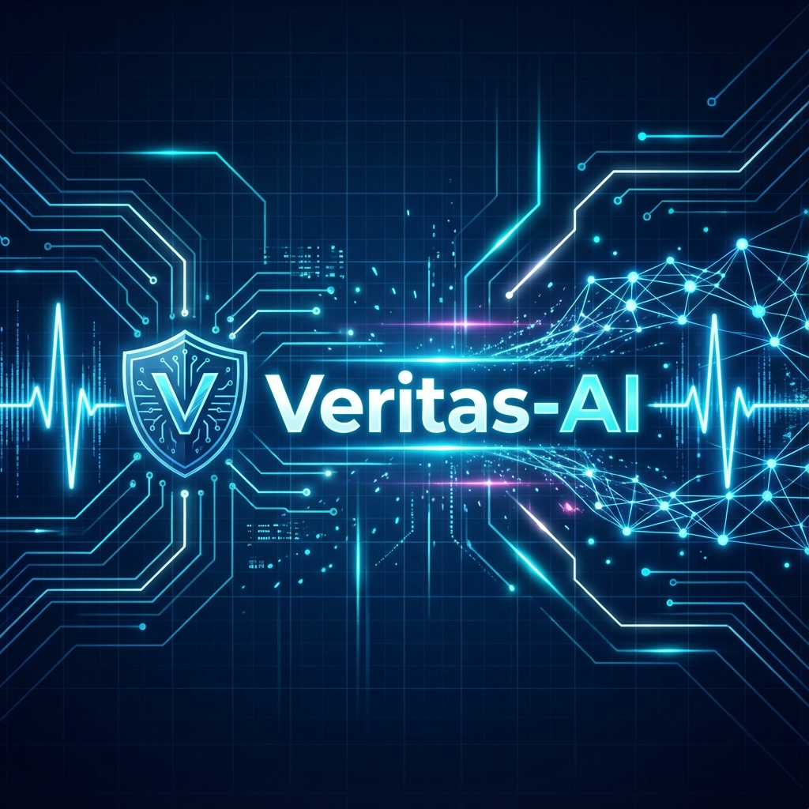

# Veritas-AI 🛡️

[](https://opensource.org/licenses/MIT)
[](https://www.python.org/downloads/)
[](https://nodejs.org/)
[](https://developer.chrome.com/docs/extensions/)

> **The Digital Bio-Guard: Real-time Deepfake Detection using Biometric Signal Analysis (rPPG) and Multimodal AI.**



Veritas-AI is an open-source browser extension designed to restore trust in digital media. It verifies video authenticity by detecting **rPPG (Remote Photoplethysmography)** signals—the subtle, invisible pulse-induced skin color changes that generative AI and deepfakes currently cannot replicate faithfully.

---

## 🌟 Key Pillars

- **❤️ Bio-Guard (rPPG)**: Advanced pixel-level analysis to extract human heartbeats. Since AI-generated faces lack a circulatory system, this serves as a definitive "proof of life."
- **🧠 Physics-Guard (Gemini AI)**: Leverages Google's Gemini 2.0 Flash to detect non-human artifacts, inconsistent lighting, and boundary blending errors.
- **⚡ Seamless Integration**: Operates as a lightweight overlay on platforms like YouTube, providing real-time authenticity scores.
- **🔒 Privacy-Centric**: Designed for local processing. Ephemeral analysis ensures that your viewing data remains private.

## 🛠️ Technology Stack

*   **Frontend**: React 18, TypeScript, Vite, Tailwind CSS (Glassmorphic Design)
*   **Backend**: FastAPI, OpenCV (Signal Processing), NumPy, SciPy
*   **AI Engine**: MediaPipe (Facial Mesh Stabilization), Google Gemini 2.0 Oracle
*   **Architecture**: Decoupled Client-Server architecture for high-performance video frame analysis.

## 📚 Technical Documentation

Explore our deep-dives into the system architecture and forensic methodology:

- [**Getting Started Guide**](docs/GETTING_STARTED.md) - Quick setup for developers.
- [**System Architecture**](docs/PROJECT_OVERVIEW.md) - How Veritas-AI works under the hood.
- [**Forensic Capabilities**](docs/FEATURES.md) - Deep dive into the detection modules.
- [**Usage Guide**](docs/USAGE.md) - How to use the extension.
- [**Deployment Guide**](docs/DEPLOYMENT.md) - Production and cloud setup.
- [**Technical Enhancements**](docs/ENHANCEMENTS.md) - Optimization history and changelog.

---

## 🚀 Quick Start (Local Development)

### 1. Backend Setup
```bash
cd backend
python -m venv venv
source venv/bin/activate  # or .\venv\Scripts\activate on Windows
pip install -r requirements.txt
cp .env.example .env      # Add your GEMINI_API_KEY
python -m uvicorn main:app --host 0.0.0.0 --port 8000
```

### 2. Extension Setup
```bash
cd extension
npm install
npm run build
```
Load the `extension/dist` folder into Chrome via `chrome://extensions/`.

---

## 🗺️ Roadmap & Future Vision

We are committed to making Veritas-AI the industry standard for consumer-grade deepfake detection. 

-  **Mobile Support**: Extending the detection engine to mobile browsers and apps.
-  **Multi-Face Analysis**: Parallel rPPG extraction for group videos and debates.
-  **Edge Processing**: Moving the entire rPPG engine to WebAssembly (Wasm) for 100% local analysis.
-  **Audio Analysis**: Integrating voice clones detection for multimodal verification.

## 🤝 Contributing

We welcome contributions from the community! Whether you are a computer vision expert, a frontend wizard, or a cybersecurity enthusiast, there is a place for you here.

Please read our [**Contributing Guidelines**](CONTRIBUTING.md) to get started.

## 📄 License

Veritas-AI is released under the **MIT License**. See [LICENSE](LICENSE) for more details.

---

<p align="center">
  Built with ❤️ for a Truthful Digital Future.
</p>
