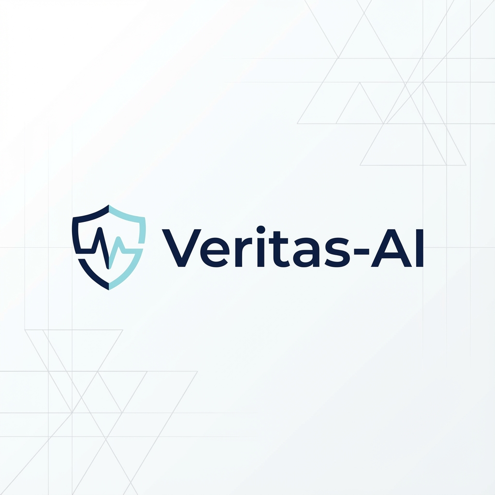
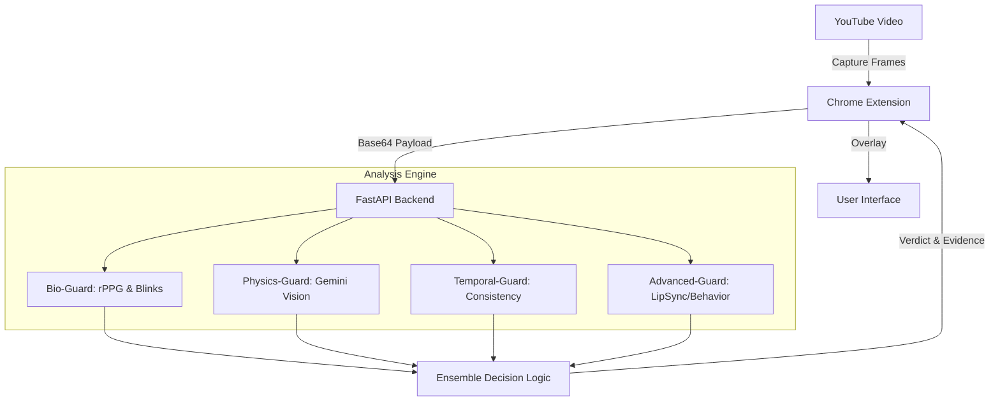

# Veritas-AI 🛡️

[](https://opensource.org/licenses/MIT)
[](https://www.python.org/downloads/)
[](https://nodejs.org/)
[](https://developer.chrome.com/docs/extensions/)

> **The Digital Bio-Guard: Real-time Deepfake Detection using Biometric Signal Analysis (rPPG) and Multimodal AI.**



Veritas-AI is an open-source browser extension designed to restore trust in digital media. It verifies video authenticity by detecting **rPPG (Remote Photoplethysmography)** signals — the subtle, invisible pulse-induced skin color changes that generative AI and deepfakes currently cannot replicate faithfully.

---

## 🏗️ System Architecture

Veritas-AI uses a decoupled client-server architecture designed for high-performance video analysis without compromising browser stability.

1.  **Frontend (Extension)**: A React-based Chrome extension that injects into YouTube pages. It handles frame capture, local state management, and the user interface.
2.  **Communication Layer**: Secure REST API utilizing FastAPI for asynchronous processing.
3.  **Backend (Analysis Engine)**: A Python-powered engine that runs multiple forensic modules in parallel to provide a comprehensive authenticity score.



---

## 🌟 Key Features

-   **❤️ Bio-Guard (rPPG)**: Advanced pixel-level analysis to extract human heartbeats. Since AI-generated faces lack a circulatory system, this serves as a definitive "proof of life."
-   **👁️ Natural Behavior Detection**: Analyzes eye blink patterns and micro-expressions that are often absent or unnatural in synthetic media.
-   **🧠 Physics-Guard (Gemini AI)**: Leverages Google's Gemini 2.0 Oracle to detect non-human artifacts, inconsistent lighting, and boundary blending errors.
-   **⚡ Seamless Integration**: Operates as a lightweight overlay on platforms like YouTube, providing real-time authenticity scores.
-   **🔒 Privacy-Centric**: Designed for local processing. Ephemeral analysis ensures that your viewing data remains private.

---

## 🛠️ Technology Stack

| Layer | Technologies |
| :--- | :--- |
| **Frontend** | React 18, TypeScript, Vite, Tailwind CSS, Shadcn/UI |
| **Backend** | Python 3.11+, FastAPI, Uvicorn |
| **CV / ML** | OpenCV, MediaPipe, NumPy, SciPy |
| **LLM / Vision** | Google Gemini 2.0 Flash (Vision API) |
| **DevOps** | Docker, Docker Compose, GitHub Actions |

---

## 📂 Repository Structure

```text
Veritas-AI/
├── backend/                # Analysis engine and API
│   ├── api/                # API endpoints and middleware
│   ├── modules/            # Forensic analysis modules (rPPG, Gemini, etc.)
│   ├── tests/              # Backend testing suite
│   └── main.py             # Server entry point
├── extension/              # Chrome extension source
│   ├── content/            # Injected scripts and frame capture
│   ├── popup/              # Extension control panel UI
│   ├── background/         # Service worker logic
│   └── public/             # Static assets
├── docs/                   # Detailed documentation and project assets
└── README.md               # Home base
```

---

## 🔄 User Flows

### 1. Verification Flow
1.  **Detection**: The extension automatically identifies video players on supported sites (e.g., YouTube).
2.  **Trigger**: The user clicks the "VERITAS" seal on the video player.
3.  **Analysis**: The extension captures a sequence of frames and sends them to the backend.
4.  **Feedback**: A progress bar indicates status (Capturing -> Analyzing -> Verdict).
5.  **Result**: A glassmorphic overlay appears with the authenticity score and a list of forensic evidence.

---

## ⚠️ Known Limitations & Future Improvements

### Current Limitations
-   **Hardware Dependent**: rPPG accuracy depends on video quality (720p+ recommended) and facial lighting.
-   **Single Face**: The current version is optimized for a single dominant face in the frame.
-   **Latency**: Full multimodal analysis takes 5–15 seconds depending on hardware.

### Roadmap
-   [ ] **Wasm Integration**: Moving the rPPG engine to WebAssembly for 100% offline detection.
-   [ ] **Voice Clone Detection**: Adding audio analysis to detect synthetic speech patterns.
-   [ ] **Multi-Face Support**: Detecting authenticity for multiple people in debates or interviews.
-   [ ] **Real-time Streaming**: Optimizing for live stream verification.

---

## 🤝 Contributing

We welcome contributions! Whether it's a new detection module, UI improvements, or bug fixes.

1.  **Fork** the repo.
2.  **Create** your feature branch (`git checkout -b feature/AmazingFeature`).
3.  **Commit** your changes (`git commit -m 'Add some AmazingFeature'`).
4.  **Push** to the branch (`git push origin feature/AmazingFeature`).
5.  **Open** a Pull Request.

Please see our [CONTRIBUTING.md](CONTRIBUTING.md) for more details.

---

## 🚀 Getting Started

Discover how to set up Veritas-AI in minutes in our [**Getting Started Guide**](docs/GETTING_STARTED.md).

---

## 📄 License

Veritas-AI is released under the **MIT License**. See [LICENSE](LICENSE) for more details.

<p align="center">
  Built with ❤️ for a Truthful Digital Future.
</p>
